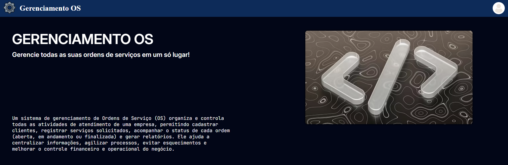
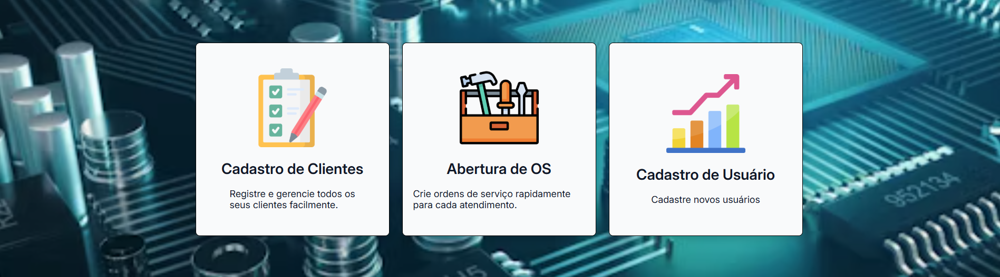
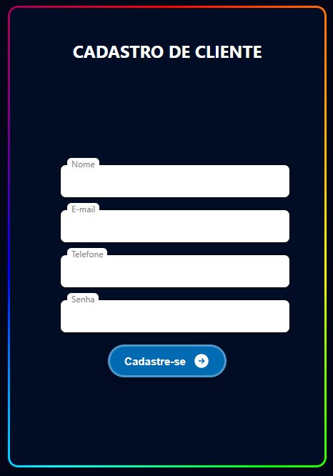

---


# 💎 Gerenciamento-OS
Sistema de cadastro de um painel de Gerenciamento de OS.

## 💠 Preview




## 💠 Link
- [GitHub](https://www.github.com/marcospmtech/Gerenciamento-OS)
- [Demo](https://marcospmtech.github.io/Gerenciamento-OS/)

## 💠 Estrutura do Projeto
```
/Gerenciamento-OS
├── cad/
│   ├── cadcli.html
│   ├── cados.html
│   └── caduse.html
├── data/
│   └── img/
│       ├── bg/
│       ├── icon/
│       ├── img/
│       ├── logo/
│       └── preview/
├── style/
│   ├── cad.css
│   ├── index.css
│   └── style.css
├── docs_design/
│   └── tokens.json
├── index.html
└── README.md
```

## 💠 Como rodar
Abrir o arquivo ``index.html`` no seu navegador ou acesso o link demo em [💠 Link](#-link)

## 💠 Funcionalidades
- Sistema de login
- Hero
- Área de cadastro

## 💠 Contato
- Marcos Pereira Monea
- marcos.monea@yahoo.com
- [GitHub](https://www.github.com/marcospmtech)
- [LinkedIn](https://www.linkedin.com/in/marcostech)

## 💠 Licença
This project is open-source and licensed under the MIT License, which allows anyone to use, copy, modify, and distribute this software.
See the full license in the [LICENSE](LICENSE) file.